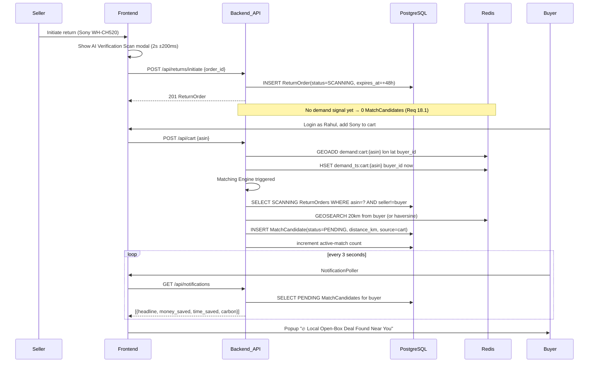
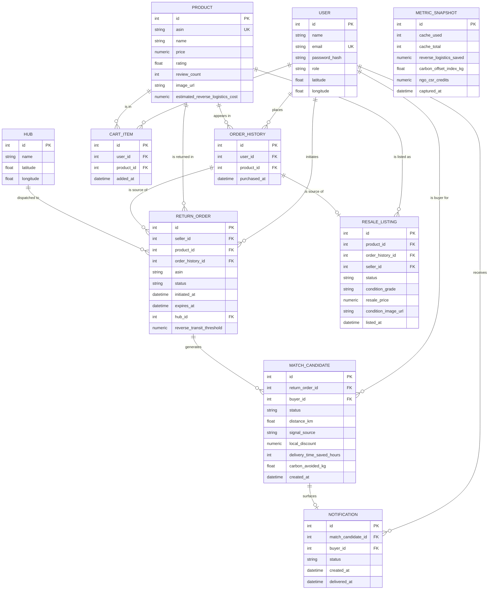
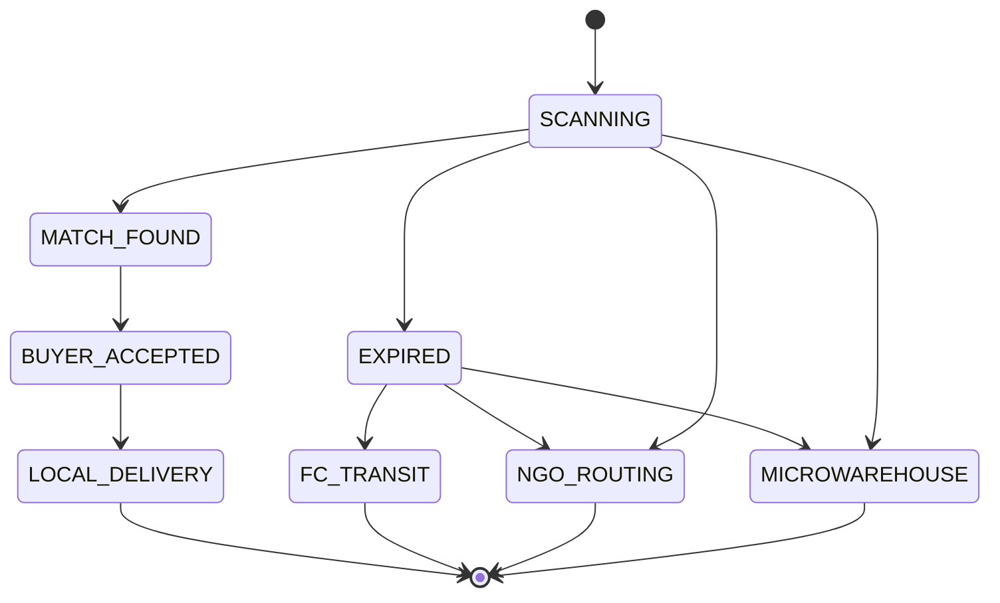

# Design Document

## Overview

Amazon Edge-Return is a four-tier prototype that intercepts returns in real time and routes them to nearby buyers, NGOs, micro-warehouses, or fulfillment centers. A returned item enters a 48-hour "scanning pool" (Requirement 3) and becomes discoverable to buyers who signal purchase intent for the same ASIN within a 20km radius. A continuous matching engine (Requirement 6) reacts to demand signals recorded in a Redis geospatial index (Requirement 4), scores them (Requirement 5), and surfaces "Local Open-Box Deal" notifications (Requirements 7, 8). Unclaimed returns auto-route at expiry (Requirement 10). The system also exposes a resale marketplace (Requirements 11, 12) and an operations admin dashboard (Requirements 13–16), all wrapped in an Amazon-accurate visual shell (Requirement 17).

This document specifies a production-stack prototype:

- **Frontend**: Next.js (App Router), React, TailwindCSS, Lucide React icons, with 3-second short-polling for match notifications (Requirement 8.1).
- **Backend**: FastAPI (asynchronous ASGI), exposing the REST contract in this document.
- **Relational store**: PostgreSQL accessed via SQLAlchemy (async ORM) + asyncpg driver.
- **Geospatial/cache store**: Redis accessed via `redis-py`, using native geospatial commands `GEOADD` and `GEOSEARCH`.

### Design Goals and Rationale

| Goal | Decision | Rationale |
|------|----------|-----------|
| Real-time intercept feel | 3s short-polling notification endpoint | Requirement 8.1 explicitly allows polling at 3s; simpler than WebSockets for a prototype while meeting the latency bound. |
| Native geo matching | Redis `GEOADD`/`GEOSEARCH` | Requirement 4.5 mandates native geospatial add; Redis computes 20km radius candidates in one command (Requirement 6.4). |
| Deterministic dispositions | Explicit `Return_Lifecycle` state machine | Requirement 10 enumerates exactly which transitions are legal; a centralized transition table prevents illegal states. |
| Trustworthy resale | Split-Trust gallery (official + live-condition image) | Requirement 12.8 requires both images so buyers see the real item against the catalog photo. |
| Correctness under randomness | Property-based testing of pure logic cores | Matching, scoring, discount, and the state machine are pure functions amenable to universal properties (see Correctness Properties). |

## Architecture

### Component Architecture

```mermaid
graph TB
    subgraph Client["Frontend — Next.js App Router"]
        Login["/login"]
        Catalog["/ home + catalog"]
        PDP["/product/[asin]"]
        Cart["/cart"]
        Orders["/orders (Seller)"]
        ScanModal["AI Verification Scan Modal"]
        Deals["/local-deals"]
        Admin["/admin/operations"]
        Poller["NotificationPoller (3s)"]
    end

    subgraph API["Backend — FastAPI (async ASGI)"]
        Auth["Auth/Session Service"]
        DemandSvc["Demand Signal Service"]
        Matcher["Matching Engine"]
        ReturnSvc["Return Lifecycle Service"]
        NotifySvc["Notification Service"]
        ResaleSvc["Resale Service"]
        AdminSvc["Admin Metrics/Ops Service"]
        Sweeper["Expiry Sweep Scheduler"]
        Pricing["Pricing/Impact Calculator"]
    end

    subgraph PG["PostgreSQL (SQLAlchemy async + asyncpg)"]
        T_User[(User)]
        T_Product[(Product)]
        T_Order[(OrderHistory)]
        T_Return[(ReturnOrder)]
        T_Match[(MatchCandidate)]
        T_Resale[(ResaleListing)]
        T_Cart[(CartItem)]
        T_Notif[(Notification)]
        T_Metric[(MetricSnapshot)]
        T_Hub[(Hub)]
    end

    subgraph Redis["Redis (redis-py) — Geospatial Demand Index"]
        Geo["demand:{intent}:{asin} (GEO sets)"]
        Ts["demand_ts:{intent}:{asin} (signal timestamps)"]
    end

    Login --> Auth
    Catalog --> DemandSvc
    PDP --> DemandSvc
    Cart --> DemandSvc
    Orders --> ReturnSvc
    Orders --> ResaleSvc
    ScanModal --> ReturnSvc
    Deals --> ResaleSvc
    Admin --> AdminSvc
    Poller --> NotifySvc

    DemandSvc --> Geo
    DemandSvc --> Ts
    DemandSvc --> Matcher
    Matcher --> Geo
    Matcher --> ReturnSvc
    Matcher --> Pricing
    Matcher --> NotifySvc
    Matcher --> T_Match
    ReturnSvc --> T_Return
    Sweeper --> ReturnSvc
    NotifySvc --> T_Match
    NotifySvc --> T_Notif
    ResaleSvc --> T_Resale
    AdminSvc --> T_Return
    AdminSvc --> T_Metric
    Auth --> T_User
```



### Matching Sequence (Demo Flow, Requirement 18)



### Layered Responsibility

- **Transport layer** (FastAPI routers): request/response validation (Pydantic), session resolution, error mapping.
- **Service layer**: business logic. The pure, side-effect-free cores (state machine transition table, matching selection, scoring, discount, impact) are isolated so they can be property-tested independently of I/O.
- **Persistence layer**: SQLAlchemy async repositories for PostgreSQL; a thin Redis gateway for the geospatial index.
- **Scheduler**: an asyncio background task (the expiry sweep) that polls for newly-expired SCANNING returns.

## Components and Interfaces

### Auth / Session Service (Requirement 1)

Real login model, not a user switcher. Seeded accounts have credentials (email + password hash). On successful login the service issues a signed, HTTP-only session cookie carrying the user id; the backend resolves the active user from the cookie on every user-context request (Requirement 1.4). Logout invalidates the session server-side (Requirement 1.6). Switching users replaces all user-scoped data the frontend renders (Requirement 1.7).

- `login(email, password) -> Session | AuthError` — verifies against seeded accounts (Requirements 1.1–1.3).
- `resolve_session(cookie) -> UserId | None` — used by a FastAPI dependency injected into protected routes (Requirement 1.4).
- `logout(session) -> None` (Requirement 1.6).
- Seller capability gate: a user may act as Seller only if they have ≥1 OrderHistory record (Requirement 1.5).

### Demand Signal Service (Requirement 4)

Records buyer intent into Redis and triggers matching. One method per intent that all funnel into a common writer:

- `record_signal(intent, asin, buyer) -> SignalResult` where `intent ∈ {cart, buynow, wishlist, viewed}`.
  - Validates coordinates within bounds: lon ∈ [-180, 180], lat ∈ [-90, 90]; rejects absent/out-of-bounds without any Redis write (Requirement 4.6).
  - `GEOADD demand:{intent}:{asin} <lon> <lat> <buyer_id>` — member is the buyer id, overwriting any prior entry for that buyer under the same key (Requirement 4.5).
  - `HSET demand_ts:{intent}:{asin} <buyer_id> <epoch_ms>` records the signal timestamp for scoring tie-breaks (Requirement 5.3).
  - If `GEOADD` fails, returns a failure result and does not report success (Requirement 4.7).
  - On success, synchronously invokes the Matching Engine for that ASIN (Requirements 4.x → 6.1).

### Matching Engine (Requirement 6)

Triggered on every recorded demand signal. Pure selection core wrapped by an I/O shell.

Pipeline:
1. Identify the ASIN from the signal (Requirement 6.1).
2. Query candidate ReturnOrders: `status = SCANNING AND expires_at > now() AND product.asin = signal.asin AND seller_id != buyer_id` (Requirement 6.2).
3. For each candidate, compute distance in km between buyer and the candidate's seller, rounded to 2 decimals. Distance comes from Redis (`GEOSEARCH ... WITHDIST`) or a haversine fallback when computing seller-to-buyer directly (Requirement 6.3).
4. Filter to candidates within `Match_Radius = 20 km`; select the smallest distance, tie-broken by earliest `expires_at` (Requirements 6.4, 6.8).
5. Duplicate guard: if a PENDING MatchCandidate already exists for `(buyer, return_order)`, do nothing (Requirements 6.9).
6. Otherwise create `MatchCandidate(status=PENDING, distance_km, signal_source=intent)` (Requirement 6.5), trigger notification (Requirement 6.6), and increment the active-match count (Requirement 6.7).
7. If nothing qualifies, create no candidate and leave existing candidates untouched (Requirement 6.10).

Scoring (Requirement 5) is applied when multiple signals/candidates compete for a single ReturnOrder: `Cart=100, BuyNow=90, Wishlist=70, Viewed=40`; highest score first, earliest timestamp breaks ties.

### Return Lifecycle Service (Requirement 10)

Owns the transition table and the auto-routing decision. All status changes go through `transition(return_order, target)` which validates against the table, rejecting undefined and terminal-source transitions (Requirements 10.5, 10.7). On the `SCANNING → EXPIRED` transition it computes `Reverse_Transit_Threshold = Estimated_Reverse_Logistics_Cost + ₹150` and auto-routes (Requirements 10.9–10.12). On `ACCEPTED` it advances `SCANNING → MATCH_FOUND → BUYER_ACCEPTED → LOCAL_DELIVERY` (Requirement 9.5).

### Expiry Sweep Scheduler (Requirements 3.4, 3.5)

An asyncio task running on a sub-second cadence (default 500ms) selects SCANNING ReturnOrders whose `expires_at <= now()` with no ACCEPTED MatchCandidate, and drives each through `transition(..., EXPIRED)`, which immediately triggers auto-routing and expires PENDING sibling candidates (Requirement 9.4). The tight cadence satisfies the "within 1 second of detection" bound.

### Notification Service (Requirements 7, 8)

- `GET /api/notifications` returns PENDING MatchCandidates for the active buyer, each enriched with the deal headline, money saved, delivery time saved, and carbon avoided (Requirements 8.1, 8.2). Carbon is omitted when avoided < 0.1 kg (Requirement 7.3).
- Notifications persist in PENDING until delivered or the ReturnOrder leaves SCANNING (Requirement 8.6).
- Accept/reject hide the popup client-side within 1 second (Requirements 8.4, 8.5).

### Pricing / Impact Calculator (Requirement 7)

Pure function `compute_deal(product_price, estimated_logistics_savings, distances...) -> DealImpact`:
- `Local_Discount = MIN(estimated_logistics_savings, 0.15 * product_price)`, non-negative, rounded to 2 decimals, values < 0.01 → 0.00 (Requirement 7.1).
- `delivery_time_saved_hours = max(0, round(...))` whole hours (Requirement 7.2).
- `carbon_avoided_kg = max(0, round(..., 1))`; flagged hidden when < 0.1 (Requirements 7.2, 7.3).

### Resale Service (Requirements 11, 12)

- `POST /api/resale/list`: validates `condition_grade ∈ {"Like New","Good","Fair"}` (Requirements 11.2–11.4), requires non-empty `condition_image_url` (Requirements 11.6, 11.7), sets `resale_price ∈ (0, product_price]`, `status=ACTIVE`, `listed_at=now()`.
- `GET /api/resale/feed`: returns ACTIVE listings joined with Product and original OrderHistory purchase date, newest `listed_at` first; empty collection when none; both image URLs included (Requirements 12.1, 12.2, 12.7).

### Admin Operations Service (Requirements 13–16)

- `GET /api/admin/metrics`: Cache Storage Capacity (used/total), Reverse Logistics Saved, Carbon Offset Index, NGO CSR Credits; all-or-nothing on retrieval failure (Requirements 13.1, 13.3).
- `GET /api/admin/returns?status=`: returns ReturnOrders (joined Product + User) filtered by a recognized status or `ALL`; rejects unknown status (Requirements 14.1–14.3).
- `POST /api/admin/dispatch`: validates supported action + non-empty hub id; transitions all `RTO_QUEUED` → `FC_TRANSIT`, recalculates and returns metrics (Requirements 16.1–16.5).

## Data Models

### Entity Relationship Diagram



### SQLAlchemy Schema Notes

- **User** (Requirements 1, 2.3, 2.4): `email` unique with `password_hash`; `role` is advisory (a user with OrderHistory may always act as Seller per Requirement 1.5). `latitude`/`longitude` seed Priya (12.9781, 77.6389) and Rahul (12.9352, 77.6271).
- **Product** (Requirement 2.5): `asin` is `UNIQUE NOT NULL`; `price NUMERIC(10,2) CHECK (price > 0)`; `rating CHECK (rating BETWEEN 0 AND 5)`; `review_count CHECK (review_count >= 0)`; `image_url NOT NULL`. `estimated_reverse_logistics_cost NUMERIC(10,2) CHECK (>= 0)` feeds the EXPIRED routing decision (Requirement 10.9).
- **OrderHistory** (Requirement 2.6): `purchased_at < now()`; the 7-day rule (Requirement 11.1) is evaluated against this timestamp.
- **ReturnOrder** (Requirements 3, 10): `status` constrained to the lifecycle enum; `expires_at = initiated_at + 48h`; `order_history_id` links the source purchase; `reverse_transit_threshold` is persisted when computed at EXPIRED; `hub_id` set on dispatch.
- **MatchCandidate** (Requirements 6, 7, 9): `status ∈ {PENDING, ACCEPTED, REJECTED, EXPIRED}`; carries `distance_km`, `signal_source`, and the cached deal impact (`local_discount`, `delivery_time_saved_hours`, `carbon_avoided_kg`). A partial unique index on `(return_order_id, buyer_id) WHERE status='PENDING'` enforces the duplicate guard (Requirement 6.9).
- **ResaleListing** (Requirements 11, 12): `status ∈ {ACTIVE, ...}`; `condition_grade ∈ {Like New, Good, Fair}`; `resale_price CHECK (> 0)` and `<= product.price` enforced in service; `condition_image_url NOT NULL` non-empty.
- **CartItem**: backs cart contents and demand-signal recording on add (Requirement 4.1).
- **Notification**: tracks PENDING→delivered state to honor retry/preservation semantics (Requirement 8.6).
- **MetricSnapshot**: stores admin KPI values; recalculated on dispatch (Requirement 16.2).
- **Hub**: dispatch target for `POST /api/admin/dispatch` (Requirement 16).

### Status Enumerations

- **ReturnOrder.status**: `SCANNING, MATCH_FOUND, BUYER_ACCEPTED, LOCAL_DELIVERY, EXPIRED, FC_TRANSIT, NGO_ROUTING, MICROWAREHOUSE`.
  - Admin filter aliases (Requirement 14.5): `CACHED ≡ MICROWAREHOUSE`, `RTO_QUEUED ≡ EXPIRED` (awaiting reverse transit), `NGO_QUEUED ≡ NGO_ROUTING`. The API maps these display aliases to canonical states.
- **MatchCandidate.status**: `PENDING, ACCEPTED, REJECTED, EXPIRED`.
- **ResaleListing.status**: `ACTIVE` (extensible to `SOLD`, `REMOVED`).

### Redis Inverted Geospatial Demand Index (Requirement 4)

The index is "inverted": keyed by `(intent, asin)` so the matching engine can, for any ASIN, retrieve all interested buyers and their locations in one geo query.

| Aspect | Design |
|--------|--------|
| Key schema | `demand:{cart\|buynow\|wishlist\|viewed}:{asin}` |
| Command (write) | `GEOADD demand:{intent}:{asin} <lon> <lat> <buyer_id>` (Requirement 4.5) |
| Member | Buyer identifier — one entry per buyer per key; re-adding overwrites coordinates (Requirement 4.5) |
| Timestamp sidecar | `HSET demand_ts:{intent}:{asin} <buyer_id> <epoch_ms>` for scoring tie-breaks (Requirement 5.3) |
| Command (read/match) | `GEOSEARCH demand:{intent}:{asin} FROMLONLAT <lon> <lat> BYRADIUS 20 km ASC WITHDIST` (Requirements 6.3, 6.4) |
| Demand scoring weights | Cart=100, BuyNow=90, Wishlist=70, Viewed=40 (Requirement 5.1) |
| Coordinate validation | lon ∈ [-180,180], lat ∈ [-90,90]; reject before write (Requirement 4.6) |
| Seed state | Zero entries; no ASIN absent from the catalog (Requirement 2.7) |


## Matching Engine and Demand Scoring Design

The Matching_Engine runs synchronously as part of recording a demand signal (Req 6.1: "WHEN a Demand_Signal is recorded"). This keeps the prototype simple and guarantees the match exists before the buyer's next 3-second poll.

### Algorithm

```
on_demand_signal(asin, buyer, signal_type):
  1. candidates <- SELECT ReturnOrder
        WHERE status = SCANNING
          AND asin = :asin
          AND seller_id != buyer.id          # self-match exclusion (Req 6.2)
          AND expires_at > now()             # non-expired (Req 6.2)
  2. if candidates empty: return None         # (Req 6.10)
  3. for c in candidates:
        c.distance_km = round(haversine(buyer.point, c.seller.point), 2)   # (Req 6.3)
  4. eligible <- [c for c in candidates if c.distance_km <= 20.0]           # (Req 6.4, 6.8)
  5. if eligible empty: return None
  6. selected <- min(eligible, key=(distance_km, expires_at))               # tie -> earliest expiry (Req 6.4)
  7. if PENDING MatchCandidate exists for (buyer, selected): return None     # duplicate guard (Req 6.9)
  8. discount <- PriceOptimizer.local_discount(product.price, est_savings)   # (Req 7.1)
  9. mc <- INSERT MatchCandidate(PENDING, distance_km, signal_source=signal_type, local_discount=discount)
 10. AnalyticsCounter.active_match_count += 1                                # (Req 6.7)
 11. enqueue notification(buyer, mc)                                         # (Req 6.6)
 12. return mc
```

### Demand Scoring & Selection Among Multiple Signals

When a single ReturnOrder is matchable by multiple demand signals (across buyers/intents), ranking uses Demand_Score descending, then earliest timestamp (Req 5.2, 5.3):

```
score(signal) = { cart:100, buynow:90, wishlist:70, viewed:40 }[signal.type]
rank_key(signal) = (-score(signal), signal.created_at)   # ascending sort -> best first
```

The current trigger model processes one buyer's signal at a time, so scoring primarily governs *which buyer is offered first* when the engine evaluates the demand set for a return. The pure function `rank_signals(signals) -> ordered list` encapsulates this and is property-tested.

### Local Deal Price Optimization

```
local_discount(price, est_logistics_savings):
    raw = min(est_logistics_savings, Decimal("0.15") * price)
    raw = max(raw, 0)                 # non-negative (Req 7.1)
    rounded = round(raw, 2)
    return Decimal("0.00") if rounded < Decimal("0.01") else rounded

savings_summary(...):
    money_saved          = local_discount(price, est_logistics_savings)     # currency, 2dp (Req 7.2)
    delivery_time_saved  = max(0, floor(est_delivery_hours_saved))          # whole hours >= 0 (Req 7.2)
    carbon_kg            = round(max(0, est_carbon_kg), 1)                   # 1dp, >= 0 (Req 7.2)
    include_carbon       = carbon_kg >= 0.1                                  # suppress hollow claims (Req 7.3)
```

When `include_carbon` is false the notification omits the carbon field entirely and makes no environmental claim (Req 7.3).

## Return Lifecycle State Machine

The lifecycle is a **total, explicit transition relation**. Any (source, target) pair not in the relation is invalid and rejected without mutation (Req 10.7).

### State Diagram



### Transition Table

| Source | Allowed Targets |
|--------|-----------------|
| SCANNING | MATCH_FOUND, EXPIRED, NGO_ROUTING, MICROWAREHOUSE |
| MATCH_FOUND | BUYER_ACCEPTED |
| BUYER_ACCEPTED | LOCAL_DELIVERY |
| EXPIRED | FC_TRANSIT, NGO_ROUTING, MICROWAREHOUSE |
| LOCAL_DELIVERY | — (terminal) |
| FC_TRANSIT | — (terminal) |
| NGO_ROUTING | — (terminal) |
| MICROWAREHOUSE | — (terminal) |

Terminal states (LOCAL_DELIVERY, FC_TRANSIT, NGO_ROUTING, MICROWAREHOUSE) permit no further transition (Req 10.6). Any request from a terminal state, or any undefined pair, returns an "invalid transition" error naming source and target (Req 10.7).

### Automatic Expiry Routing

When a ReturnOrder transitions SCANNING→EXPIRED (Req 3.4, 9.4), the system:

1. Computes `Reverse_Transit_Threshold = Product.est_reverse_logistics_cost + 150` (Req 10.9).
2. Automatically routes to exactly one terminal-ward state (Req 10.12):
   - `price <= threshold` → **NGO_ROUTING** (Req 10.10)
   - `price >  threshold` → **MICROWAREHOUSE** (Req 10.11)

The RTO/FC path (EXPIRED→FC_TRANSIT) is driven by the admin batch dispatch action (Req 16) rather than automatic routing; the auto-route covers NGO vs MICROWAREHOUSE. EXPIRED→FC_TRANSIT remains a legal manual/dispatch transition (Req 10.2, 10.8).

### Match-Driven Transitions

When a MatchCandidate is ACCEPTED, the ReturnOrder advances SCANNING→MATCH_FOUND→BUYER_ACCEPTED→LOCAL_DELIVERY (Req 9.5), and all other PENDING candidates for that ReturnOrder are set EXPIRED (Req 9.8). If a ReturnOrder leaves SCANNING for any reason while candidates remain PENDING, those candidates become EXPIRED (Req 9.4).

## Resale Marketplace & Split-Trust Design

### Listing Flow

1. Frontend shows "Resell via Amazon" only for orders with `purchased_at` > 7 days ago (Req 11.1).
2. On click, `MockAIGradingScanModal` runs 2 s (Req 11.5), producing a mock `condition_grade` and a `condition_image_url` (mock camera capture).
3. `POST /api/resale/list` validates grade ∈ {Like New, Good, Fair} (Req 11.3/11.4) and non-empty `condition_image_url` (Req 11.6/11.7), creates an ACTIVE ResaleListing with `0 < resale_price <= Product.price` (Req 11.2).

### Feed & Split-Trust Gallery

`GET /api/resale/feed` returns ACTIVE listings joined with Product and original purchase date, newest-first (Req 12.1), each carrying both `Product.image_url` and `condition_image_url` as non-empty URLs (Req 12.7); empty when none (Req 12.2); store error → full error, no partial set (Req 12.3).

The `/local-deals` page renders the grid "Amazon Local Verified Used Deals" (Req 12.4/12.5). Each card shows the "✅ Amazon Verified Original Purchase" badge + Condition Grade (Req 12.6) and a **Split-Trust gallery**: the official `Product.image_url` as the primary image (trusted catalog reference) and the `condition_image_url` as a secondary thumbnail badged "Live Condition" (Req 12.8). The split conveys trust by pairing the idealized catalog image with the actual item condition.

## Admin Operations Design

### Metrics (Req 13)

`GET /api/admin/metrics` returns:
- **Cache Storage Capacity**: `{ used, total }` where `0 <= used <= total`, `total >= 1`. `used` = count of MICROWAREHOUSE (CACHED) returns; `total` from `AnalyticsCounter.cache_capacity_total`.
- **Reverse Logistics Saved**: non-negative currency (sum of realized local-delivery discounts + avoided reverse costs).
- **Carbon Offset Index**: non-negative kg CO2.
- **NGO CSR Credits**: non-negative currency (accrued from NGO_ROUTING dispositions).

If any metric cannot be retrieved, the endpoint returns an error with no partial values (Req 13.3). The KPIGrid renders four columns; zero values render as "0"/"0.00"/"0.0", never blank (Req 13.2, 13.4).

### Data Table (Req 14)

`GET /api/admin/returns?status=<S|ALL>` returns returns joined with Product and User. Unrecognized status → error (Req 14.3); no match → empty array (Req 14.2). Columns: ID, Product (thumbnail + ASIN), Source (user + location), Status badge, Time Remaining, Actions (Req 14.4). Filter dropdown options exactly: All, SCANNING, CACHED, RTO_QUEUED, NGO_QUEUED (Req 14.5).

### Live Countdown (Req 15)

`LiveCountdownTimer` ticks once per second from `expires_at - now`, formatted HH:MM:SS zero-padded. Remaining in `(0, 7200)` s → red text blinking at 1 Hz; `>= 7200` s → default color, no blink; `<= 0` → "00:00:00", frozen.

### Batch Dispatch (Req 16)

`POST /api/admin/dispatch { action, hub_id }`:
- Validate `action` ∈ supported set (else error, no changes — Req 16.3); require non-empty `hub_id` (else error — Req 16.4).
- Transition every RTO_QUEUED return → FC_TRANSIT; return success with transitioned count (Req 16.1); recalc + return KPIs (Req 16.2).
- Zero RTO_QUEUED → success, count 0, no changes (Req 16.5).

## Visual Design Tokens (Req 17)

Tailwind theme extension:

```js
colors: {
  amazonNavy:   "#232F3E",  // top nav (Req 17.1)
  amazonDark:   "#131921",  // secondary header band
  amazonOrange: "#FF9900",  // accents
  amazonLink:   "#007185",  // text links
  amazonBg:     "#EAEDED",  // page background
  adminSlate:   "#020617",  // admin slate-950 full-viewport bg (Req 17.3)
}
```

Primary buttons: 8px radius on all corners + top→bottom linear gradient `#FFD814 → #F7CA00` (Req 17.2). Body text on customer pages must meet ≥ 4.5:1 contrast (Req 17.4) — dark text (#0F1111) on #EAEDED/#FFFFFF satisfies this; verified during component review.

## Seeding Strategy (Req 2)

`seed.py` executes three ordered phases inside a single transaction where possible, aborting on any failure with a non-zero exit and identifying the failed phase (Req 2.2):

1. **Drop** all tables (idempotent whether or not they exist — Req 2.1).
2. **Recreate** schema from SQLAlchemy metadata.
3. **Populate**: Priya Sharma (Seller, 12.9781, 77.6389), Rahul Verma (Buyer, 12.9352, 77.6271, empty cart); 5–50 products each with valid ASIN/name/price/rating/review_count/image_url (incl. "Sony WH-CH520 Wireless Headphones" and "Levi's T-Shirt"); ≥ 2 OrderHistory rows for Priya referencing those two products with past `purchased_at`; initialize Redis with zero demand entries referencing only seeded ASINs (Req 2.3–2.7).

Relational seeding and Redis flush are coordinated so that a relational failure leaves nothing committed (Req 2.2), and Redis is flushed of demand keys to guarantee zero signals (Req 2.7).

## REST API Contract

All user-context endpoints require an authenticated session cookie; the active user id is resolved server-side (Requirement 1.4). Error responses use a consistent shape `{ "error": { "code": string, "message": string } }`.

| Method | Path | Request | Success Response | Errors |
|--------|------|---------|------------------|--------|
| POST | `/api/auth/login` | `{email, password}` | `200 {user_id, name, role}` + session cookie | `401 AUTH_FAILED` (Req 1.3) |
| POST | `/api/auth/logout` | — (session) | `204` | — |
| GET | `/api/auth/session` | — (session) | `200 {user_id, name, role, can_sell}` | `401 NO_SESSION` |
| POST | `/api/cart` | `{asin}` | `201 {cart_item}` (records cart demand signal) | `400 INVALID_LOCATION` (Req 4.6), `401`, `502 SIGNAL_NOT_RECORDED` (Req 4.7) |
| GET | `/api/cart` | — (session) | `200 [cart_items]` | `401` |
| POST | `/api/buynow` | `{asin}` | `201 {ok}` (records buynow signal) | `400 INVALID_LOCATION`, `401`, `502 SIGNAL_NOT_RECORDED` |
| POST | `/api/wishlist` | `{asin}` | `201 {ok}` (records wishlist signal) | `400 INVALID_LOCATION`, `401`, `502 SIGNAL_NOT_RECORDED` |
| POST | `/api/view` | `{asin}` | `202 {ok}` (records viewed signal) | `400 INVALID_LOCATION`, `401`, `502 SIGNAL_NOT_RECORDED` |
| POST | `/api/returns/initiate` | `{order_history_id}` | `201 {return_order}` (status SCANNING) | `401 NO_SESSION`, `403 RETURN_NOT_PERMITTED` (Req 3.7) |
| POST | `/api/returns/{id}/transition` | `{target_status}` | `200 {id, status}` | `409 INVALID_TRANSITION` (Req 10.7), `401`, `404` |
| GET | `/api/notifications` | — (session) | `200 [{candidate_id, headline, money_saved, time_saved_hours, carbon_avoided_kg?}]` | `401` |
| POST | `/api/matches/{id}/accept` | — (session) | `200 {candidate_id, status: ACCEPTED}` | `403 NOT_AUTHORIZED` (Req 9.7), `409 OFFER_UNAVAILABLE` (Req 9.6), `401` |
| POST | `/api/matches/{id}/reject` | — (session) | `200 {candidate_id, status: REJECTED}` | `403 NOT_AUTHORIZED`, `409 OFFER_UNAVAILABLE`, `401` |
| POST | `/api/resale/list` | `{order_history_id, condition_grade, condition_image_url, resale_price}` | `201 {resale_listing}` | `400 UNSUPPORTED_GRADE` (Req 11.4), `400 CONDITION_IMAGE_REQUIRED` (Req 11.7), `401` |
| GET | `/api/resale/feed` | — | `200 [{listing, product, original_purchased_at, image_url, condition_image_url}]` | `503 STORE_UNAVAILABLE` (Req 12.3) |
| GET | `/api/admin/metrics` | — | `200 {cache_used, cache_total, reverse_logistics_saved, carbon_offset_index_kg, ngo_csr_credits}` | `503 METRICS_UNAVAILABLE` (Req 13.3) |
| GET | `/api/admin/returns?status=` | query `status` (ALL or recognized/alias) | `200 [{return_order, product, user}]` | `400 INVALID_STATUS` (Req 14.3) |
| POST | `/api/admin/dispatch` | `{action, hub_id}` | `200 {transitioned_count, metrics}` | `400 UNSUPPORTED_ACTION` (Req 16.3), `400 HUB_REQUIRED` (Req 16.4) |

## Frontend Route and Component Structure

| Route | Purpose | Key Components | Requirements |
|-------|---------|----------------|--------------|
| `/login` | Real auth login (not a user switcher) listing seeded accounts | `LoginForm`, `AccountList` | 1.1–1.3 |
| `/` | Home + catalog grid | `NavBar`, `ProductGrid`, `ProductCard` | 17.1 |
| `/product/[asin]` | Product detail; fires view signal; cart/buynow/wishlist actions | `ProductDetail`, `BuyBox`, `PrimaryButton` | 4.1–4.4, 17.2 |
| `/cart` | Cart contents | `CartList`, `PrimaryButton` | 1.8 |
| `/orders` | Seller order history; Return + Resell (7-day rule) | `OrderRow`, `ReturnButton`, `ResellButton` | 1.5, 11.1 |
| (modal) | AI verification scan before return/resale submit | `AIVerificationScanModal` (2s ±200ms) | 3.6, 11.5 |
| `/local-deals` | Verified used deals grid | `DealsGrid`, `SplitTrustGallery`, `VerifiedBadge` | 12.4–12.8 |
| `/admin/operations` | Dark-mode ops console | `KPIGrid`, `OperationsDataTable`, `LiveCountdownTimer`, `StatusFilter`, `DispatchButton` | 13–16, 17.3 |
| (global) | Match notification poller + popup | `NotificationPoller` (3s), `MatchNotificationPopup` | 8.1–8.5 |

### Visual Design Tokens (Requirement 17)

- Customer-facing (Req 17.1): top nav `#232F3E`, secondary band `#131921`, accent `#FF9900`, text links `#007185`, page background `#EAEDED`.
- Primary buttons (Req 17.2): 8px radius all corners, top-to-bottom linear gradient `#FFD814` → `#F7CA00`.
- Admin dashboard (Req 17.3): full-viewport slate-950 `#020617` dark background.
- Body text contrast ≥ 4.5:1 (Req 17.4).

### LiveCountdownTimer Behavior (Requirement 15)

Updates once per second, formatted `HH:MM:SS` zero-padded. When remaining time is in (0, 7200) seconds, render red and blink at 1s interval (Req 15.2); at ≥ 7200 seconds render default color without blinking (Req 15.3); at ≤ 0 display `00:00:00` and stop (Req 15.4).

## Error Handling

The backend uses a consistent error envelope and maps domain errors to HTTP status codes. Error responses use the shape `{ "error": { "code": string, "message": string } }` (as reflected in the REST API Contract above). No partial writes or partial result sets are ever returned — transactions roll back on failure.

### Error Class to HTTP Mapping

| Error class | Trigger | HTTP | Behavior |
|-------------|---------|------|----------|
| `AuthError` | Unknown account / no session | 401 | No session established; frontend shows auth-failed message (Req 1.3, 3.7) |
| `ForbiddenError` | Non-owner acts on a candidate | 403 | Candidate unchanged; "not authorized" (Req 9.7) |
| `NotEligibleError` | Return for product not in history | 422 | No ReturnOrder created (Req 3.7) |
| `InvalidLocationError` | Coordinates out of bounds/absent | 422 | No Redis write (Req 4.6) |
| `OfferUnavailableError` | Accept/reject non-PENDING candidate | 409 | Status unchanged (Req 9.6) |
| `InvalidTransitionError` | Undefined/terminal lifecycle transition | 409 | Status unchanged; names source+target (Req 10.7) |
| `UnsupportedGradeError` | condition_grade not in set | 422 | No ResaleListing (Req 11.4) |
| `MissingImageError` | Empty/omitted condition_image_url | 422 | No ResaleListing (Req 11.7) |
| `InvalidStatusFilterError` | Unrecognized admin status filter | 400 | No data returned (Req 14.3) |
| `UnsupportedActionError` | Dispatch action not supported | 400 | No status changes (Req 16.3) |
| `MissingHubError` | Empty/omitted hub identifier | 400 | No status changes (Req 16.4) |
| `StoreUnavailableError` | DB unreachable (feed/metrics) | 503 | Full error, no partial set/values (Req 12.3, 13.3) |
| `SignalStorageError` | Redis GEOADD failure | 502 | Signal not reported stored (Req 4.7) |

### Validation and Input Safety

- **Pydantic request models** validate all request bodies and query params at the transport boundary. ASIN, status, action, and condition_grade are validated against enumerations before any service logic runs.
- **Geo bounds validation** (Requirement 4.6): coordinates are validated to lon ∈ [-180, 180], lat ∈ [-90, 90] before any Redis write; out-of-bounds or absent coordinates yield `400 INVALID_LOCATION` with no side effect.
- **State transition validation** (Requirement 10.7): all transitions consult the lifecycle table; undefined or terminal-source transitions yield `409 INVALID_TRANSITION` identifying source and target, leaving status unchanged.
- **Authorization** (Requirements 3.7, 9.6, 9.7): return initiation requires ownership of the referenced OrderHistory; match accept/reject requires the candidate's buyer identity and PENDING status.

### Failure Semantics

- **Redis write failure** (Requirement 4.7): `GEOADD` failures return `502 SIGNAL_NOT_RECORDED`; the signal is never reported as stored and matching is not triggered.
- **All-or-nothing reads** (Requirements 12.3, 13.3): the resale feed and admin metrics return an error and no partial data when the store is unreachable.
- **Seed atomicity / seed-failure handling** (Requirement 2.2): the seed script runs drop → create → populate in a transaction-guarded sequence; failure in any phase aborts subsequent phases, rolls back any uncommitted relational data, prints the failed phase, and exits non-zero.
- **Concurrency on accept** (Requirements 9.2, 9.8): accept runs in a single DB transaction that sets the candidate ACCEPTED, expires sibling PENDING candidates, and advances the ReturnOrder, preventing double-accept races via the partial unique index and row locking.
- **Transactional integrity**: demand recording first validates coordinates, then performs `GEOADD`; only on success is matching triggered. Match creation, the active-match counter increment, and notification enqueue occur in one relational transaction so the active-match count can never drift from candidate rows.

### Security Notes

- **Sessions**: signed HTTP-only cookies; server-side session invalidation on logout (Requirement 1.6). No user-context request proceeds without a resolved session.
- **Unauthenticated services**: `GET /api/resale/feed` is public by design (buyer browsing); all write endpoints and user-scoped reads require authentication. This is an intentional exposure and is flagged here — if the prototype is deployed beyond a demo, the resale feed should be rate-limited to prevent scraping.
- **Input injection**: SQLAlchemy parameterized queries throughout; Redis keys are constructed from validated ASINs and a fixed intent enum, never from raw user strings.
- **Geo bounds**: enforced server-side so malformed coordinates cannot corrupt the geospatial index.

## Testing Strategy

The project uses a **dual testing approach**: property-based tests for universal invariants on the pure decision cores (state machine, matching selection, scoring, discount/impact math, validation), and example/integration/snapshot tests for UI, visual tokens, timing/animation, and external-service behavior.

### Property-Based Testing

- **Library:** Backend pure logic is tested with **Hypothesis** (Python); any frontend pure utilities (countdown formatting, savings/discount display) are tested with **fast-check** (TypeScript).
- The team MUST NOT implement property-based testing from scratch, and MUST NOT hand-roll randomization — use the library's strategies/arbitraries.
- **Iterations:** each property test runs a **minimum of 100 iterations**.
- **Tagging:** each property test is tagged with a comment referencing its design property, using the format: `Feature: amazon-edge-return, Property {number}: {property_text}`.
- **One property → one property-based test.** Properties 1–28 in the Correctness Properties section each map to a single property-based test.
- **Generators:** custom Hypothesis strategies produce valid/invalid coordinates (including out-of-bounds for Property 6), product catalogs (Property 27), return-order pools with varied statuses and expiry times, demand-signal sets with mixed intents/timestamps (Property 7), and price/savings/carbon tuples including boundary values — exactly 0.1 kg carbon (Property 14), exactly 20.00 km distance (Properties 9, 10), discounts straddling 0.01 (Property 13), and prices straddling the reverse-transit threshold (Property 20) — grade strings inside and outside the allowed set (Property 21), and lifecycle (source, target) status pairs spanning the full enum cross-product so undefined/terminal transitions are exercised (Property 19).

### Example / Unit Tests

Focused concrete cases for: login flows (1.1–1.7), the AI scan modal durations (3.6, 11.5), notification popup rendering and dismissal (7.4, 8.2–8.5), KPIGrid formatting and zero rendering (13.2, 13.4), operations-table columns and filter behavior (14.4–14.7), and the Requirement 18 end-to-end demo scenario (18.1–18.4). Edge cases: invalid status filter (14.3), unsupported dispatch action/missing hub (16.3, 16.4), non-PENDING/non-owner candidate actions (9.6, 9.7), empty resale feed (12.2), and buyer-outside-radius (18.4).

### Integration Tests

A small number (1–3 examples each) cover external/timed behavior that does not vary meaningfully with input: notification delivery within the 3-second polling window (6.6, 8.1), Redis `GEOADD`/`GEOSEARCH` round-trips against a real/ephemeral Redis, PostgreSQL joins for the resale feed and admin returns, the expiry sweep scheduler, and the seed script running against both empty and pre-populated databases (2.1, 2.7) with injected per-phase failures (2.2).

### Snapshot / Visual Tests

Amazon design tokens, gradient buttons, the Split-Trust gallery layout, admin dark mode, and the countdown blink styling (Req 12.4–12.8, 15.2–15.3, 17.1–17.4) are validated with component snapshot tests and a contrast-ratio check for body text (17.4). Full WCAG conformance requires manual assistive-technology testing and is out of automated scope.

### Coverage Mapping Highlights

- State-machine validity and terminal-state immutability: Property 19.
- Matching filter/distance/selection invariants: Properties 8, 9, 10, 11, 12.
- Discount and impact bounds: Properties 13, 14.
- Demand scoring ordering: Property 7.
- Lifecycle cascade and expiry auto-routing invariants: Properties 17, 18, 20.
- Demand index round-trip and idempotence: Properties 4, 5, 6.

### Non-PBT Areas (Rationale)

- **Visual tokens and gradients (Requirement 17)**: verified by snapshot/style assertions, not properties — appearance does not vary meaningfully with input.
- **Timing/animation (Requirements 3.6, 8.x, 11.5, 15.x)**: verified by example tests with fake timers.
- **Seed setup (Requirements 2.1, 2.7)**: smoke tests (single execution).
- **DB/Redis wiring and failure paths (Requirements 12.3, 13.3, 4.7)**: integration tests with 1–3 representative cases.

## Correctness Properties

*A property is a characteristic or behavior that should hold true across all valid executions of a system — essentially, a formal statement about what the system should do. Properties serve as the bridge between human-readable specifications and machine-verifiable correctness guarantees.*

The following properties target the pure, deterministic cores of the system (return creation, scanner-pool membership, demand recording, scoring, matching selection, pricing, the lifecycle state machine, candidate transitions, resale validation, feed shaping, admin metrics/dispatch, and countdown formatting). UI styling, timing/latency, and external-service wiring are validated with example, integration, and snapshot tests (see Testing Strategy) rather than properties.

### Property 1: Return creation sets SCANNING and a 48-hour window

*For any* valid seller and product present in that seller's order history, initiating a return produces a ReturnOrder with status SCANNING, associated with that seller's id and the product's ASIN, whose `expires_at` minus `initiated_at` equals exactly 172,800 seconds.

**Validates: Requirements 3.1, 3.2**

### Property 2: Scanner-pool membership invariant

*For any* ReturnOrder, it is discoverable in the Return_Scanner_Pool if and only if its status is SCANNING and its `expires_at` is strictly later than the current time; an EXPIRED (or any non-SCANNING) order is never discoverable.

**Validates: Requirements 3.3, 3.5**

### Property 3: Expiry detection transitions unmatched scanning returns

*For any* ReturnOrder with status SCANNING whose `expires_at` is at or before the current time and which has no ACCEPTED MatchCandidate, the expiry sweep transitions it to EXPIRED.

**Validates: Requirements 3.4**

### Property 4: Demand signals map to the correct key with buyer coordinates

*For any* buyer with valid coordinates, ASIN, and signal type ∈ {cart, buynow, wishlist, viewed}, recording the signal writes to exactly the key `demand:{type}:{asin}` with the buyer's identifier as the member at the buyer's (longitude, latitude).

**Validates: Requirements 4.1, 4.2, 4.3, 4.4**

### Property 5: Demand recording is per-buyer idempotent (overwrite)

*For any* sequence of demand signals from the same buyer to the same key, at most one entry for that buyer exists under that key afterward, and its coordinates equal those of the most recent recording.

**Validates: Requirements 4.5**

### Property 6: Invalid buyer coordinates are rejected with no write

*For any* longitude outside [−180, 180] or latitude outside [−90, 90] (or absent coordinates), recording is rejected, no write is made to the Geospatial_Index, and an invalid-location error is returned.

**Validates: Requirements 4.6**

### Property 7: Demand signal ranking by score then timestamp

*For any* set of demand signals, ranking orders them by Demand_Score descending (cart=100, buynow=90, wishlist=70, viewed=40), breaking ties by earliest recorded timestamp; the first ranked signal has the maximum score and, among maximum-score signals, the earliest timestamp.

**Validates: Requirements 5.1, 5.2, 5.3**

### Property 8: Distance is the haversine distance rounded to two decimals

*For any* two geographic points, the computed `distance_km` equals the haversine distance between them rounded to two decimal places.

**Validates: Requirements 6.3**

### Property 9: Match selection picks the nearest eligible candidate

*For any* recorded demand signal and pool of ReturnOrders, the engine considers only candidates with status SCANNING, non-expired `expires_at`, matching ASIN, and a seller different from the buyer; among those within 20 km it selects exactly the one with the smallest `distance_km`, breaking ties by earliest `expires_at`; if none are within 20 km it selects none.

**Validates: Requirements 6.1, 6.2, 6.4, 6.8**

### Property 10: Match creation produces a PENDING candidate and bumps the active-match count

*For any* selected eligible candidate within 20 km for which no PENDING MatchCandidate already exists for the (buyer, ReturnOrder) pair, the engine creates exactly one MatchCandidate with status PENDING, the computed `distance_km`, and `signal_source` equal to the signal type, and increments the active-match count by exactly one.

**Validates: Requirements 6.5, 6.7, 9.1**

### Property 11: No duplicate PENDING candidates

*For any* (buyer, ReturnOrder) pair that already has a PENDING MatchCandidate, re-processing a demand signal creates no second MatchCandidate.

**Validates: Requirements 6.9**

### Property 12: No eligible candidate leaves match state unchanged

*For any* recorded demand signal for which no ReturnOrder satisfies the selection conditions, the engine creates no MatchCandidate and leaves all existing MatchCandidate records unchanged.

**Validates: Requirements 6.10**

### Property 13: Local discount bound and rounding

*For any* product price and estimated logistics savings, the Local_Discount equals MIN(savings, 0.15 × price) clamped to be non-negative and rounded to two decimal places, with any rounded value below 0.01 reported as 0.00; it never exceeds either the savings or 15% of the price.

**Validates: Requirements 7.1**

### Property 14: Savings summary field bounds and carbon suppression

*For any* savings inputs, the notification summary reports money saved equal to the Local_Discount (2 dp currency), delivery time saved as a whole number of hours ≥ 0, and carbon avoided as a value ≥ 0 rounded to 1 dp; when the carbon value is below 0.1 kg the summary omits the carbon field entirely and makes no environmental claim.

**Validates: Requirements 7.2, 7.3**

### Property 15: PENDING candidates persist while their return is SCANNING

*For any* PENDING MatchCandidate whose associated ReturnOrder remains SCANNING and on which no accept/reject action has occurred, repeated notification polling leaves the candidate in PENDING status.

**Validates: Requirements 8.6**

### Property 16: Candidate accept/reject transitions

*For any* PENDING MatchCandidate, the owning buyer accepting it yields status ACCEPTED and rejecting it yields status REJECTED.

**Validates: Requirements 9.2, 9.3**

### Property 17: Accept advances the return along the local-delivery path

*For any* MatchCandidate that transitions to ACCEPTED, its associated ReturnOrder advances through SCANNING → MATCH_FOUND → BUYER_ACCEPTED → LOCAL_DELIVERY.

**Validates: Requirements 9.5**

### Property 18: Leaving SCANNING expires outstanding PENDING candidates

*For any* ReturnOrder that leaves SCANNING (including via an accepted match, expiry, NGO_ROUTING, or MICROWAREHOUSE), every other MatchCandidate for that ReturnOrder still in PENDING becomes EXPIRED.

**Validates: Requirements 9.4, 9.8**

### Property 19: State-machine legality matches the transition table

*For any* (source, target) status pair, a transition is permitted if and only if the pair appears in the Return_Lifecycle transition table; a permitted transition sets the status to exactly the target, and any unpermitted pair (including any transition from a terminal state) is rejected, leaves the status unchanged, and yields an invalid-transition error identifying the source and target.

**Validates: Requirements 10.1, 10.2, 10.3, 10.4, 10.5, 10.6, 10.7, 10.8**

### Property 20: Expiry auto-routing is total and threshold-driven

*For any* ReturnOrder transitioning from SCANNING to EXPIRED, the Reverse_Transit_Threshold equals the product's Estimated_Reverse_Logistics_Cost plus ₹150, and the order is automatically routed to exactly one of NGO_ROUTING (when price ≤ threshold) or MICROWAREHOUSE (when price > threshold).

**Validates: Requirements 10.9, 10.10, 10.11, 10.12**

### Property 21: Resale listing validation

*For any* resale request, a listing is created if and only if the condition_grade is one of {"Like New", "Good", "Fair"}, the condition_image_url is a non-empty string, and the resale_price satisfies 0 < resale_price ≤ product price; on success the listing has status ACTIVE, the provided grade, image URL, price within bound, and `listed_at` set to the current time; otherwise no listing is created and the appropriate validation error is returned.

**Validates: Requirements 11.2, 11.3, 11.4, 11.6, 11.7**

### Property 22: Resale eligibility by purchase age

*For any* order, the "Resell via Amazon" action is available if and only if the order's `purchased_at` is more than 7 days before the current time.

**Validates: Requirements 11.1**

### Property 23: Resale feed is active-only, ordered, and fully joined

*For any* set of resale listings, `GET /api/resale/feed` returns exactly the ACTIVE listings, ordered by `listed_at` most-recent-first, each including its joined Product, original purchase date, and both a non-empty Product `image_url` and a non-empty `condition_image_url`.

**Validates: Requirements 12.1, 12.7**

### Property 24: Admin metric bounds

*For any* system state, `GET /api/admin/metrics` returns a Cache Storage Capacity with 0 ≤ used ≤ total and total ≥ 1, and non-negative values for Reverse Logistics Saved, Carbon Offset Index, and NGO CSR Credits.

**Validates: Requirements 13.1**

### Property 25: Admin returns filter

*For any* recognized status value or ALL, `GET /api/admin/returns` returns every ReturnOrder whose status matches the requested value (all orders when ALL), each joined with its Product and User, and an empty array when none match.

**Validates: Requirements 14.1, 14.2**

### Property 26: Batch dispatch transitions all RTO_QUEUED returns

*For any* set of ReturnOrders, a dispatch with a supported action and non-empty hub identifier transitions exactly those with status RTO_QUEUED to FC_TRANSIT, leaves all other returns unchanged, returns a transitioned count equal to the prior number of RTO_QUEUED returns (zero when none), and returns recalculated metrics that satisfy the metric bounds.

**Validates: Requirements 16.1, 16.2, 16.5**

### Property 27: Product catalog invariants

*For any* seeded/validated product catalog, every product has a non-empty ASIN unique across the catalog, a non-empty name, a price greater than 0, a rating within [0.0, 5.0], a review_count integer ≥ 0, and a non-empty image_url.

**Validates: Requirements 2.5**

### Property 28: Countdown formatting

*For any* remaining-time value, the countdown renders as zero-padded HH:MM:SS equal to the hours/minutes/seconds decomposition of the remaining seconds when positive, and renders exactly "00:00:00" when the remaining time is at or below zero.

**Validates: Requirements 15.1, 15.4**

## Requirements Traceability

This section maps each requirement to the design elements that address it.

| Requirement | Design coverage | Verified by |
|-------------|-----------------|-------------|
| 1. Login & session | Auth_Service, AuthSessionContext, `/api/auth/*`, poll-based content replacement | Example/unit |
| 2. Catalog & seed data | Seeding Strategy, Data Models, AnalyticsCounter; product invariants | Property 27, smoke/integration |
| 3. Return initiation & pool | Return Lifecycle Service, `POST /api/returns/initiate`, scanner-pool membership | Properties 1–3; example (3.6, 3.7) |
| 4. Real-time demand index | Geospatial Gateway, Redis index design, Demand Signal Router | Properties 4–6; example (4.7) |
| 5. Demand scoring | Demand scoring & ranking function | Property 7 |
| 6. Matching engine | Matching_Engine algorithm | Properties 8–12; integration (6.6) |
| 7. Price optimization | PriceOptimizer | Properties 13–14; example (7.4) |
| 8. Notification delivery | Notification_Service, 3s poll, MatchNotificationPopup | Property 15; example/integration (8.1–8.5) |
| 9. Candidate lifecycle | Candidate lifecycle service, cascade rules | Properties 16–18, 10; edge (9.6, 9.7) |
| 10. Lifecycle state machine | LifecycleStateMachine, transition table, state diagram | Properties 19–20 |
| 11. Resale listing | Resale_Marketplace, MockAIGradingScanModal | Properties 21–22; example (11.5) |
| 12. Resale feed & Split-Trust | `/api/resale/feed`, SplitTrustGallery | Property 23; snapshot (12.4–12.8); example (12.3) |
| 13. Admin metrics | Admin Operations Service, KPIGrid | Property 24; example (13.2–13.4) |
| 14. Admin data table | `/api/admin/returns`, OperationsDataTable, label mapping | Property 25; example/edge (14.3–14.7) |
| 15. Live countdown | LiveCountdownTimer | Property 28; snapshot (15.2–15.3) |
| 16. Batch dispatch | `POST /api/admin/dispatch` | Property 26; edge (16.3, 16.4) |
| 17. Visual aesthetic | Design tokens, Tailwind theme | Snapshot/contrast |
| 18. Demo flow | End-to-end seller→buyer scenario | Example/edge scenario |

Every requirement is addressed by at least one design element and an associated verification strategy. Requirements expressed as universal invariants are covered by Properties 1–28; UI, timing, and infrastructure requirements are covered by example, integration, and snapshot tests as noted.
